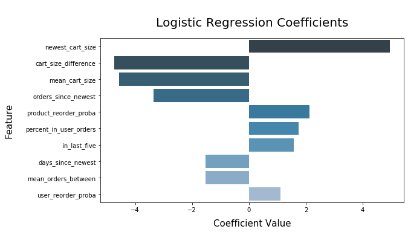
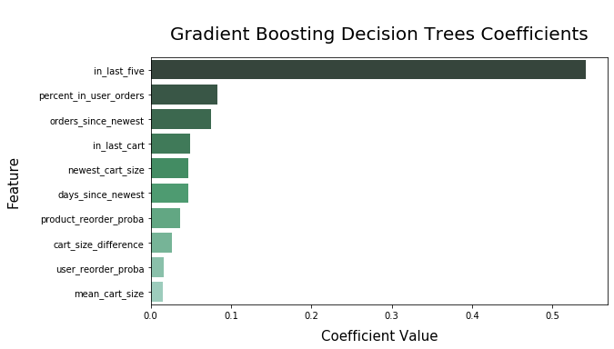

# Kaggle Instacart Classification

I built models to classify whether or not items in a user's order history will be in their most recent order, basically recreating the [**Kaggle Instacart Market Basket Analysis Competition**](https://www.kaggle.com/c/instacart-market-basket-analysis/overview/description). Because the full dataset was too large to work with on my older Macbook, I loaded the data into a SQL database on an AWS EC2 instance. This setup allowed me to easily query subsets of the data in order to do all of my preliminary development. I then cleaned up my work and wrote it into [**a script called 'build_models.py'**](code/build_models.py) that can be easily run through a notebook or the command line. Once I was ready to scale up to the full dataset, I simply ran the **build_models** script on a 2XL EC2 instance and brought the resulting models back into [**my 'kaggle_instacart' notebook**](kaggle_instacart.ipynb) for test set evaluation..

### Feature Engineering

I spent the majority of my time on this project engineering features from the basic dataset. After creating several features, I tested different combinations of them on a small subset of the data in order to eliminate any that seemed to have no effect on model output. After paring down features I ended up training and testing my final models on the following predictors:
* **percent_in_user_orders**: Percent of a user's orders in which an item appears
* **percent_in_all_orders**: Percent of all orders in which an item appears
* **in_last_cart**: 1 if an item appears in a user's most recent prior order, 0 if not
* **in_last_five**: Number of orders in a user's five most recent prior orders in which an item appears
* **total_user_orders**: Total number of orders placed by a user
* **mean_orders_between**: Average number of orders between which an item appears in a user's order
* **mean_days_between**: Average number of days between which an item appears in a user's order
* **orders_since_newest**: Number of orders between the last user order containing an item and the most recent order
* **days_since_newest**: Number of days between the last user order containing an item and the most recent order
* **product_reorder_proba**: Probability that any user reorders an item
* **user_reorder_proba**: Probability that a user reorders any item
* **mean_cart_size**: Average user cart (aka order) size
* **mean_cart_percentile**: Average percentile of user cart add order for an item
* **mean_hour_of_week**: Average hour of the week that a user orders an item (168 hours in a week)
* **newest_cart_size**: Number of items in the most recent cart
* **newest_hour_of_week**: Hour of the week that the most recent order was placed
* **cart_size_difference**: Absolute value of the difference between the average size of the orders containing an item and the size of the most recent order
* **hour_of_week_difference**: Absolute value of the difference between the average hour of the week in which a user purchases an item and the hour of the week of the most recent order

### Models

In my preliminary tests using subsets of the Instacart data, I trained a number of different models: logistic regression, gradient boosting decision trees, random forest, and KNN. After several rounds of testing, I took the two that performed best, logistic regression and gradient boosting trees, and trained them on the full data set, minus a holdout test set. I used F1 score as my evaluation metric because I wanted the models to balance precision and recall in predicting which previously ordered items would appear in the newest orders. To account for the large class imbalance caused by the majority of previously ordered items not being in the most recent orders, I created adjusted probability threshold F1 scores as well. The scores below treat each dataframe row, which represents an item ordered by a specific user, as a separate, equally-weighted entity. Both models performed similarly, with the gradient boosting trees classifier achieving slightly higher scores:

| Model                   | Raw F1 Score | Adjusted F1 Score |
| ----------------------- | ------------ | ----------------- |
| Logistic Regression     | 0.313        | 0.447             |
| Gradient Boosting Trees | 0.338        | 0.461             |

I also calculated mean per-user F1 scores that more closely match the metric of the original Kaggle contest. If either model were incorporated into a recommendation engine the user-based metric would better represent its performance. In these F1 scores, model performance is virtually identical:

| Model                   | Per-User F1 Score |
| ----------------------- | ----------------- |
| Logistic Regression     | 0.367             |
| Gradient Boosting Trees | 0.368             |

### Results

The charts below show the most influential predictors and their respective coefficient values for each model. The logistic regression model relies heavily upon information about the size of the most recent cart, while the gradient boosting decision trees model gives far more weight to the contents of a user's previous orders. If information about the most recent cart were not available, the gradient boosting model would most likely outperform the logistic regression model.

### Conclusions

This project was all about feature creation - the more features I engineered the better my models performed. At Metis I had a pretty tight deadline to get everything done and as a result did not incorporate all of the predictors I wanted to. I plan to eventually circle back and add more, including implementing some ideas from the Kaggle contest winners.
